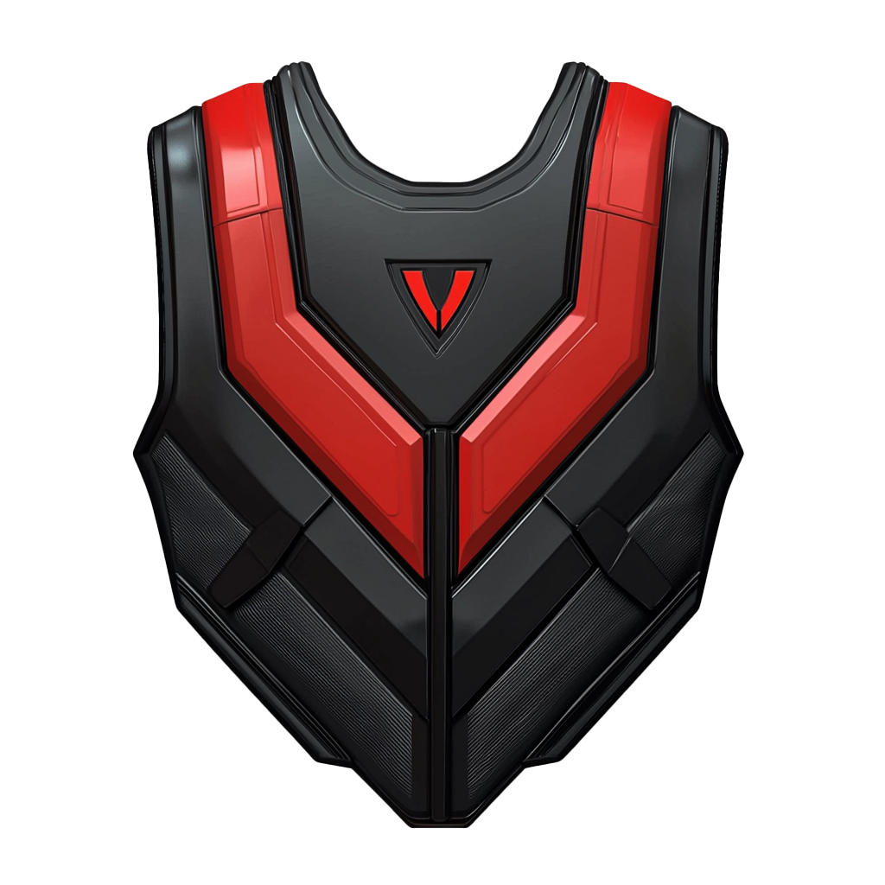
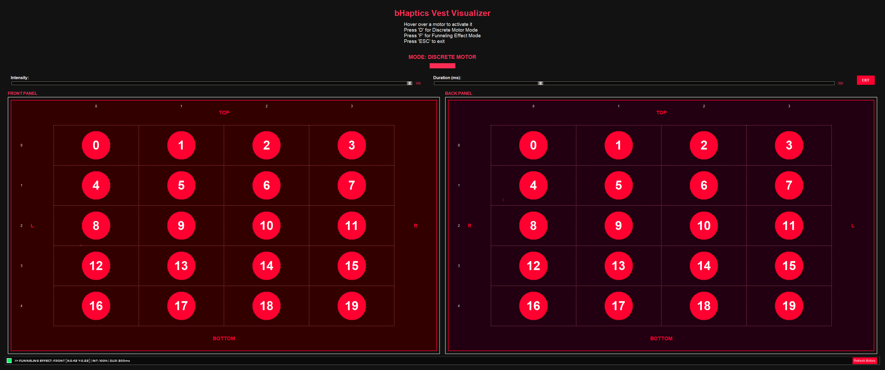

# bHaptics AIMLAB Integration

[](https://www.python.org/downloads/)
[](LICENSE)
[](https://www.bhaptics.com/develop)
[](https://github.com/nikku/works-on-my-machine)


This project provides Python scripts for controlling bHaptics haptic feedback devices locally, specifically designed for integration at AIMLAB. The implementation allows direct motor control and pattern playback without using the Official bHaptics API.



## Author

**Pi Ko**
- Email: pi.ko@nyu.edu

## Features

- **Direct Motor Control**: Precise control over individual motors in the vest
  - Funnelling effect using x,y coordinates
  - Discrete motor activation using indices
  - Intensity control (0-100)
  - Duration control (milliseconds)
  - Ctrl+C to safely quit

- **Pattern Playback**: Support for pre-designed haptic patterns
  - Load and play `.tact` pattern files
  - Synchronized front and back panel activation
  - Multiple pattern support
  - Ctrl+C to safely quit

- **Matrix Control Interface**: Intuitive array-based control
  - Visual pattern definition matching physical layout
  - Support for complex activation sequences
  - Built-in example patterns (wave, alternating)
  - Ctrl+C to safely quit

- **Visual GUI Interface**: Interactive graphical interface for haptic control
  - Full screen visualization of front and back vest panels
  - Interactive motor activation on mouse hover
  - Support for both discrete motor and funneling effect modes
  - Real-time intensity and duration control
  - Clear 4x5 grid layout showing all 20 motors per panel

- **Gloves Control Interface**: Direct control of bHaptics gloves
  - Individual motor control for left and right gloves
  - 6 motors per glove
  - Interactive motor selection and activation
  - Parameter-based motor control
  - Ctrl+C to safely quit



## Project Structure

```
bHaptics-AIMLAB/
├── haptics_pattern_player.py    # Pattern playback from .tact files
├── haptics_motor_control.py     # Direct motor control interface
├── array_example.py            # Matrix-based pattern examples
├── haptics_visualizer.pyw      # GUI application for vest visualization and control
├── haptics_gloves.py          # Gloves motor control interface
├── haptics_bridge.py          # UDP server for Unity integration
├── HapticsManager.cs          # Unity client script for haptics control
├── unified_haptics_api.py     # Unified API server for advanced integration
├── AIMlab_Haptics_Jacket_Patterns.tact  # Pre-designed patterns
├── bhaptics/                  # bHaptics SDK library (do not modify)
└── requirements.txt           # Python dependencies
```

## Motor Layout

Each vest panel (front/back) has 20 motors arranged in a 4x5 grid:
```
[0]  [1]  [2]  [3]
[4]  [5]  [6]  [7]
[8]  [9]  [10] [11]
[12] [13] [14] [15]
[16] [17] [18] [19]
```
- Reading order: Left to right, top to bottom
- Identical layout for both front and back panels
- Total motors: 40 (20 front + 20 back)

## Requirements

- Python 3.7 or higher
- bHaptics Player software installed and running
- Compatible bHaptics haptic devices
- Windows 10/11 operating system

## Dependencies

```bash
websocket-client~=0.57.0
python-osc~=1.7.4
keyboard~=0.13.5
```

## Installation

1. Clone the repository:
   ```bash
   git clone https://github.com/yourusername/bHaptics-AIMLAB.git
   cd bHaptics-AIMLAB
   ```

2. Install the required dependencies:
   ```bash
   pip install -r requirements.txt
   ```

3. 🚨⚠️ Ensure bHaptics Player is running on your system
4. 🚨⚠️ IMPORTANT: Ensure your bHaptics Player is not in Feedback Test Mode
5. Connect your bHaptics device

## Usage (Standalone Python Scripts)

### 1. Direct Motor Control (`haptics_motor_control.py`)

Two methods are available for controlling individual motors:

#### Funnelling Effect Control
```python
from haptics_motor_control import activate_funnelling

# Activate nearest motor to coordinates
activate_funnelling(
    panel='front',      # 'front' or 'back'
    x=0.5,             # 0.0 (left) to 1.0 (right)
    y=0.5,             # 0.0 (bottom) to 1.0 (top)
    intensity=100,      # 0 to 100
    duration_ms=1000    # milliseconds
)
```

#### Discrete Motor Control
```python
from haptics_motor_control import activate_discrete

# Activate specific motor by index
activate_discrete(
    panel='back',       # 'front' or 'back'
    motor_index=0,      # 0 to 19
    intensity=100,      # 0 to 100
    duration_ms=1000    # milliseconds
)
```

You can press Ctrl+C at any time to safely quit the program.

### 2. Matrix Pattern Control (`array_example.py`)

Create and play patterns using intuitive matrix representation:

```python
pattern_step = {
    "front": [
        [100, 100, 100, 100],  # Row 1
        [0, 0, 0, 0],          # Row 2
        [0, 0, 0, 0],          # Row 3
        [0, 0, 0, 0],          # Row 4
        [0, 0, 0, 0]           # Row 5
    ],
    "back": [
        [50, 50, 50, 50],      # Row 1
        [0, 0, 0, 0],          # Row 2
        [0, 0, 0, 0],          # Row 3
        [0, 0, 0, 0],          # Row 4
        [0, 0, 0, 0]           # Row 5
    ]
}

# Activate the pattern
activate_motor_array(pattern_step, duration_ms=500)
```

You can press Ctrl+C at any time to safely quit the program.

### 3. Pattern Playback (`haptics_pattern_player.py`)

Play pre-designed `.tact` patterns:

```python
from haptics_pattern_player import play_pattern

# Play a .tact file pattern
play_pattern("AIMlab_Haptics_Jacket_Patterns.tact")
```

You can press Ctrl+C at any time to safely quit the program.

### 4. Visual GUI Interface (`haptics_visualizer.pyw`)

Launch the interactive graphical interface:

```bash
# On Windows
pythonw haptics_visualizer.pyw

# On macOS/Linux
python haptics_visualizer.pyw
```

The visualizer provides:
- Interactive motor activation by hovering over motors
- Toggle between Discrete Motor and Funneling Effect modes (press 'D' or 'F')
- Adjustable intensity and duration sliders
- Press ESC to exit

### 5. Gloves Control Interface (`haptics_gloves.py`)

Control the bHaptics gloves motors:

```python
from haptics_gloves import activate_glove_motor

# Activate a specific motor on the left glove
activate_glove_motor(
    hand='left',        # 'left' or 'right'
    motor_index=0,      # 0 to 5
    intensity=100,      # 0 to 100
    duration_ms=1000    # milliseconds
)
```

Run the interactive gloves control interface:
```bash
python haptics_gloves.py
```

Features:
- Select left or right glove
- Choose motor index (0-5)
- Set intensity and duration
- Interactive menu-driven interface
- Press Ctrl+C to safely quit

## Testing

Run the example patterns:
```bash
python array_example.py
```

This will demonstrate:
1. Wave pattern (top to bottom)
2. Alternating pattern (front/back activation)

## Unity Integration

This project includes components to easily integrate bHaptics functionality into Unity applications.


### System Architecture

The system follows a client-server architecture:

- **Python Bridge (`haptics_bridge.py`)**: Acts as a server that listens for UDP messages from Unity. When it receives commands, it calls the appropriate functions from the existing haptics modules (haptics_gloves.py, haptics_motor_control.py, and haptics_pattern_player.py).

- **Unity Manager (`HapticsManager.cs`)**: Functions as a client that sends commands to the Python bridge via UDP. It provides a clean API for Unity developers to trigger various haptic effects.

### Project Structure with Unity Components

```
bHaptics-AIMLAB/
├── Python Components:
│   ├── haptics_bridge.py       # UDP server for Unity communication
│   ├── haptics_pattern_player.py
│   ├── haptics_motor_control.py
│   ├── array_example.py
│   ├── haptics_visualizer.pyw
│   ├── haptics_gloves.py
│   └── bhaptics/               # bHaptics SDK library
│
└── Unity Components:
    └── HapticsManager.cs       # Unity client for haptics control
```

### Setup Instructions

#### Python Side:

1. Ensure all haptics Python modules are in the same directory as the new `haptics_bridge.py` script.

2. Install the required dependencies:
   ```bash
   pip install bhaptics
   ```

3. Run the bridge script:
   ```bash
   python haptics_bridge.py
   ```

   The script will start a UDP server on port 9930 (configurable) and wait for commands from Unity.

#### Unity Side:

1. Create an empty GameObject in your scene and attach the `HapticsManager.cs` script to it.

2. Configure the connection settings in the Inspector:
   - **Server IP**: The IP address where the Python bridge is running (default: 127.0.0.1)
   - **Server Port**: The port number (default: 9930)
   - **Auto Connect**: Whether to connect automatically on start (default: true)

### Using the Haptics System in Unity

The `HapticsManager.cs` script provides several methods for triggering haptic effects:

#### Glove Motors

```csharp
// Activate thumb motor on left glove at full intensity for 500ms
hapticsManager.ActivateGloveMotor("left", 0, 100, 500); 

// Activate index finger motor on right glove
hapticsManager.ActivateGloveMotor("right", 1, 80, 300);
```

#### Vest Motors - Funnelling Effect

```csharp
// Activate motors near the center of the front panel
hapticsManager.ActivateFunnellingEffect("front", 0.5f, 0.5f, 100, 500);

// Activate motors on the upper right of the back panel
hapticsManager.ActivateFunnellingEffect("back", 0.75f, 0.75f, 80, 300);
```

#### Vest Motors - Discrete

```csharp
// Activate specific motor on front panel
hapticsManager.ActivateDiscreteMotor("front", 9, 100, 500);

// Activate specific motor on back panel
hapticsManager.ActivateDiscreteMotor("back", 12, 80, 300);
```

#### Pattern Playback

```csharp
// Play the registered haptic pattern
hapticsManager.PlayHapticPattern();
```

### Example Unity Implementation

```csharp
using UnityEngine;

public class HapticsExample : MonoBehaviour
{
    private HapticsManager hapticsManager;

    void Start()
    {
        // Get the HapticsManager component
        hapticsManager = FindObjectOfType<HapticsManager>();
        
        if (hapticsManager == null)
        {
            Debug.LogError("HapticsManager not found in scene!");
            return;
        }
    }

    // Example method to trigger haptic feedback when player is hit
    public void OnPlayerHit(Vector3 hitPosition, float intensity)
    {
        // Determine if hit was from front or back
        string panel = (Vector3.Dot(transform.forward, hitPosition - transform.position) > 0) ? "front" : "back";
        
        // Calculate position on vest (simplified example)
        float x = Mathf.Clamp01((hitPosition.x - transform.position.x + 0.5f) / 1.0f);
        float y = Mathf.Clamp01((hitPosition.y - transform.position.y + 1.0f) / 2.0f);
        
        // Convert intensity (0-1) to haptics intensity (0-100)
        int hapticIntensity = Mathf.RoundToInt(intensity * 100);
        
        // Trigger the haptic effect
        hapticsManager.ActivateFunnellingEffect(panel, x, y, hapticIntensity, 300);
    }
}
```

## License

This project is provided for educational purposes. Use in your own projects is permitted with attribution.

## Acknowledgments

- bHaptics for providing the Python SDK
- Unity Technologies for the Unity Engine

---

For questions, issues, or feature requests, please contact Pi Ko (pi.ko@nyu.edu).


## Contributing

1. Fork the repository
2. Create your feature branch (`git checkout -b feature/amazing-feature`)
3. Commit your changes (`git commit -m 'Add amazing feature'`)
4. Push to the branch (`git push origin feature/amazing-feature`)
5. Open a Pull Request

## License

This project is licensed under the MIT License - see the [LICENSE](LICENSE) file for details.


## Contact

For questions or support, please contact:
- Pi Ko - pi.ko@nyu.edu
- AIMLAB - [Lab Website](https://aimlab-haptics.com/)

